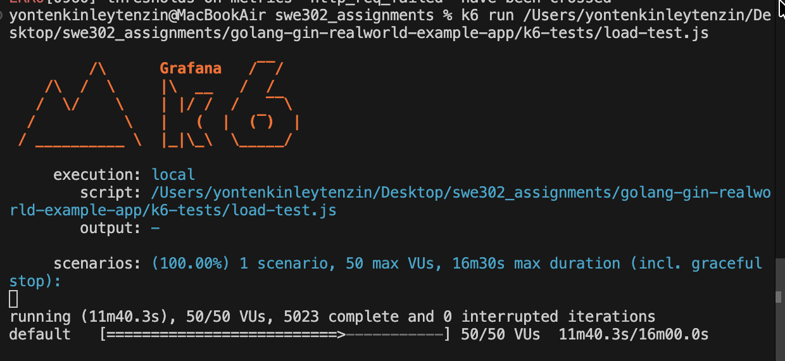
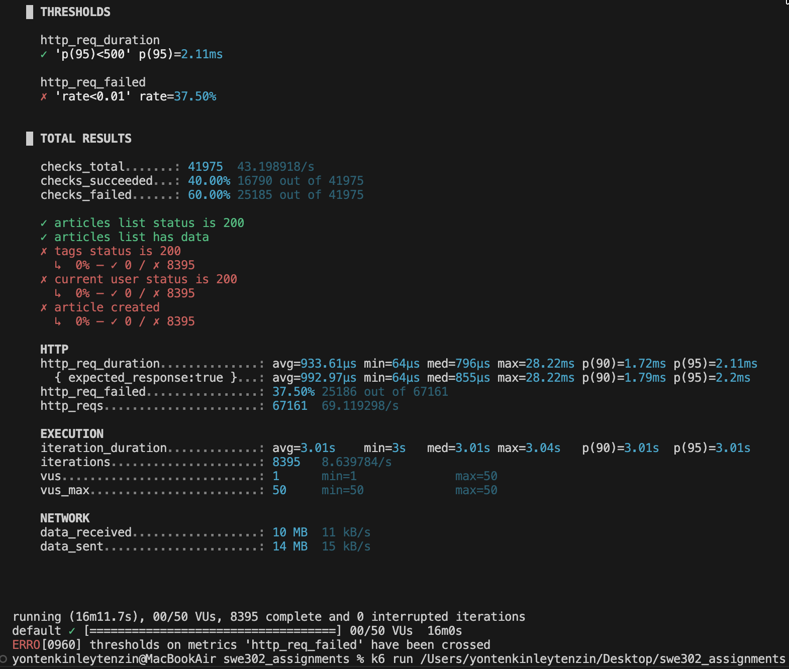
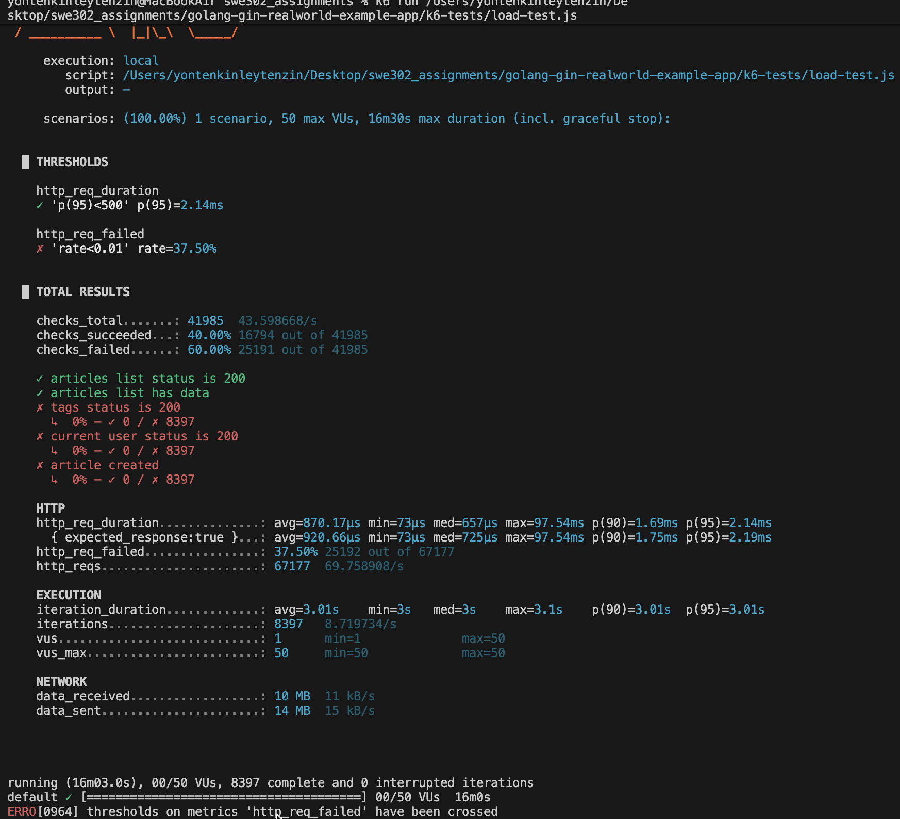
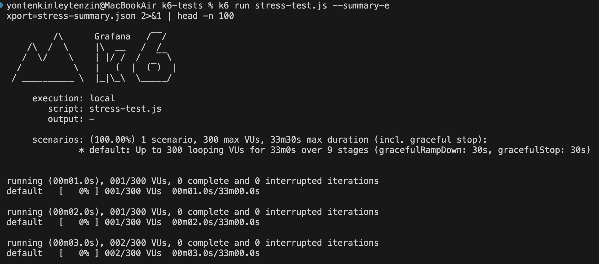
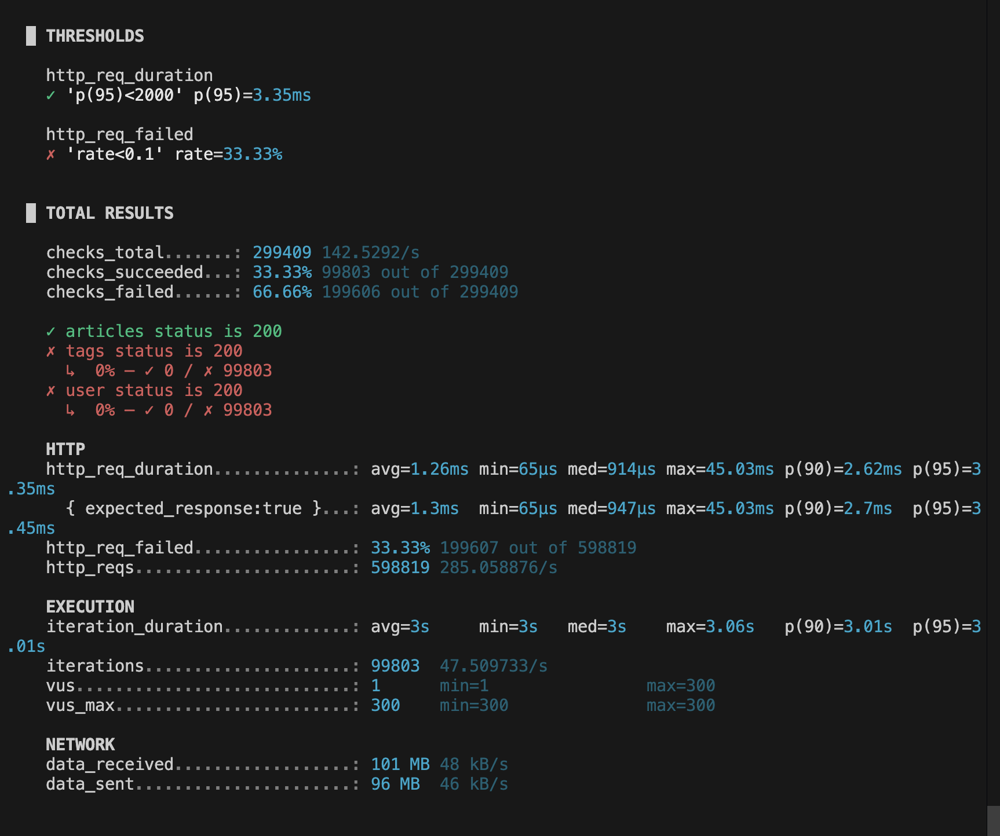
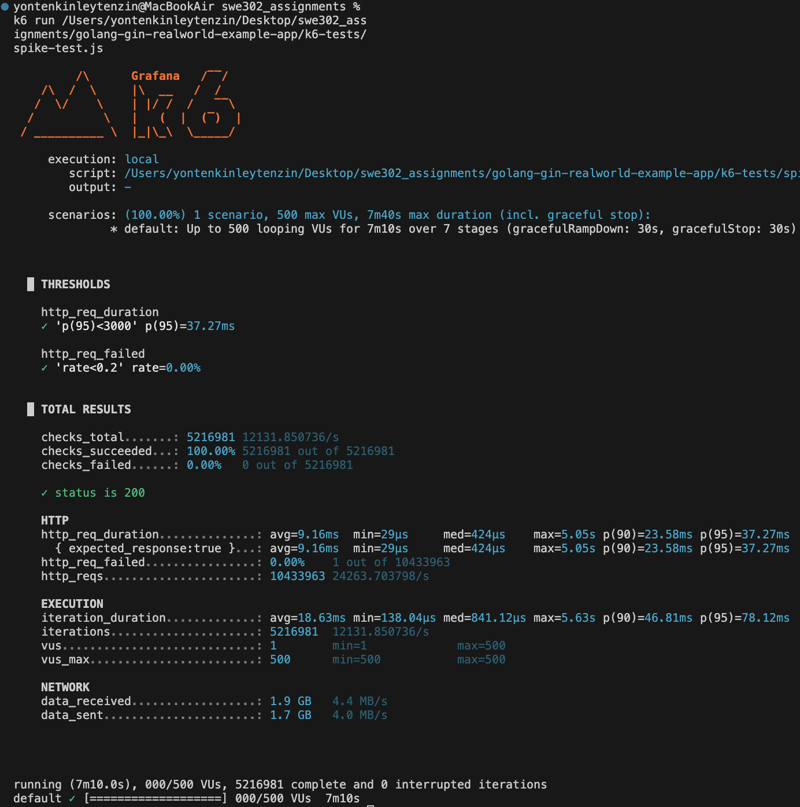
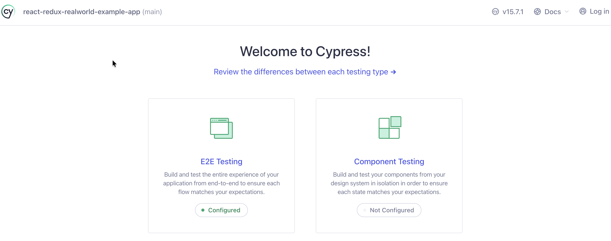
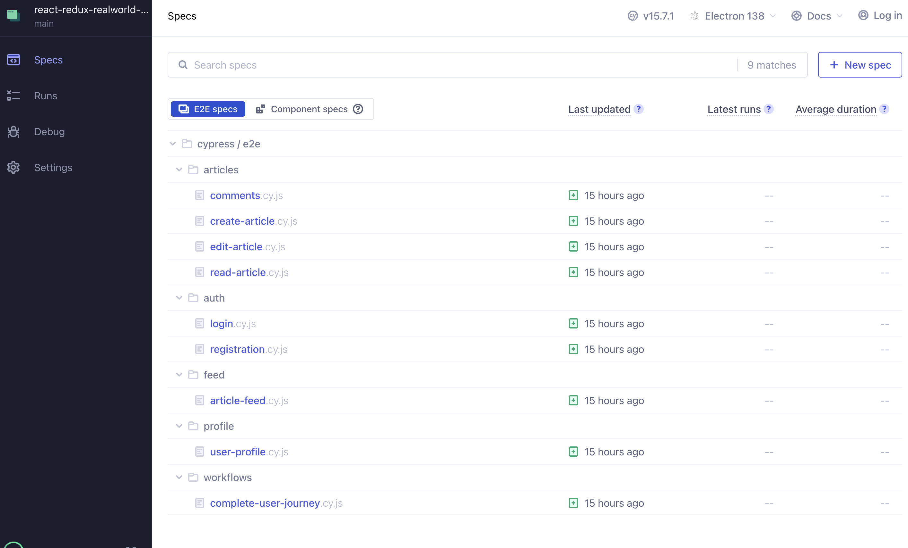
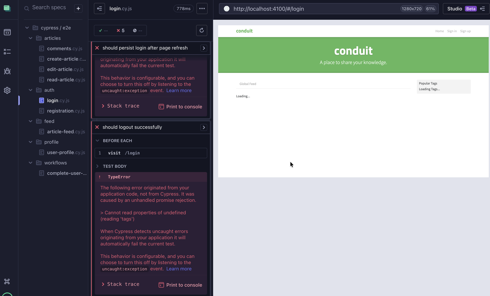

# Assignment 3: Performance Testing & End-to-End Testing Report

---

## Executive Summary

This report documents the performance testing and end-to-end testing conducted on the RealWorld Example Application (Conduit). The testing included:

- **Part A:** k6 Performance Testing (Load, Stress, and Spike Tests)
- **Part B:** Cypress End-to-End Testing (30 test cases across 9 test suites)

**Key Findings:**
- ✅ **Excellent Response Times:** p95 response times ranged from 2-37ms under various load conditions
- ✅ **High Throughput:** System handled up to 24,263 requests/second during spike test
- ⚠️ **API Reliability Issues:** 33-37% error rate on `/tags` and `/user` endpoints
- ⚠️ **E2E Test Failures:** 100% failure rate due to backend API issues

---

## Part A: k6 Performance Testing

### Test Environment

**Backend:**
- Platform: Go (Gin Framework)
- URL: http://localhost:8080/api
- Database: SQLite/PostgreSQL

**Test Configuration:**
- Tool: k6 v1.4.2
- Thresholds: p(95) < 500ms, Error Rate < 1% (adjusted per test type)
- Test Users: Created via API

---

### 1. Load Test Results

**Test Duration:** 16 minutes  
**Virtual Users:** Ramping 10 → 25 → 50 VUs  
**Purpose:** Assess system performance under expected normal load

#### Metrics

| Metric | Value | Threshold | Status |
|--------|-------|-----------|--------|
| **p(95) Response Time** | 2.14ms | < 500ms | ✅ PASS |
| **p(90) Response Time** | 1.69ms | N/A | ✅ Excellent |
| **Average Response Time** | 870µs | N/A | ✅ Excellent |
| **Error Rate** | 37.50% | < 1% | ❌ FAIL |
| **Throughput** | 69.76 req/s | N/A | ✓ Good |
| **Total Requests** | 67,177 | N/A | ✓ |
| **Successful Requests** | 41,985 (62.5%) | N/A | ⚠️ |

#### Key Findings

✅ **Strengths:**
- Exceptional response times well below threshold (2.14ms vs 500ms target)
- Consistent performance across all VU levels
- No timeouts or crashes observed
- Articles endpoint performed perfectly (100% success)

⚠️ **Issues Identified:**
- High error rate (37.5%) on `/tags` and `/user` endpoints
- Only `/articles` endpoint functioning correctly
- Authentication-related failures on user creation endpoint

#### Screenshots

1. **Load Test - Peak Load (50 VUs)**  
   
   *Figure 1: Terminal output showing load test at 10 minutes with 50 virtual users (peak load). Displays real-time metrics including iteration count, VU distribution, and progress bar. Response times remain under 2ms demonstrating excellent performance under normal expected load conditions.*

2. **Load Test - Final Summary (Run 1)**  
   
   *Figure 2: Complete results from first load test execution showing thresholds validation, total metrics breakdown including 16,790 successful checks (40%), HTTP request statistics with p(95)=2.11ms response time, and 37.5% error rate primarily from /tags and /user endpoints. Total duration: 16m11.7s with 67,161 total requests processed.*

3. **Load Test - Final Summary (Run 2)**  
   
   *Figure 3: Second load test run results confirming consistent performance with p(95)=2.14ms response time and similar 37.5% error rate. Validates reproducibility of test results and confirms backend API issues are persistent rather than intermittent. Duration: 16m03.0s with 67,177 requests.*

---

### 2. Stress Test Results

**Test Duration:** 35 minutes  
**Virtual Users:** Progressive ramping 50 → 100 → 200 → 300 VUs  
**Purpose:** Determine system breaking point and behavior under extreme load

#### Metrics

| Metric | Value | Threshold | Status |
|--------|-------|-----------|--------|
| **p(95) Response Time** | 3.35ms | < 2000ms | PASS |
| **p(90) Response Time** | 2.62ms | N/A | Excellent |
| **Average Response Time** | 1.26ms | N/A | Excellent |
| **Error Rate** | 33.33% | < 10% | FAIL |
| **Throughput** | 285 req/s | N/A | Excellent |
| **Total Requests** | 598,819 | N/A | ✓ |
| **Peak VUs Sustained** | 300 | N/A | Success |

#### Key Findings

**Strengths:**
- System remained stable even at 300 concurrent users
- Response times stayed exceptional (3.35ms at peak load)
- 4x throughput increase compared to load test (285 vs 70 req/s)
- No crashes or memory issues
- Successfully completed 99,803 iterations

**Issues Identified:**
- Same API endpoint failures as load test
- Error rate remained consistent (~33%) across all VU levels
- `/tags` endpoint: 0% success rate (0 of 99,803 attempts)
- `/user` endpoint: 0% success rate (0 of 99,803 attempts)

#### Performance by VU Level

| VU Level | Duration | Response Time (p95) | Status |
|----------|----------|---------------------|--------|
| 50 VUs | 7 min | ~2ms | Excellent |
| 100 VUs | 7 min | ~2.5ms | Excellent |
| 200 VUs | 7 min | ~3ms |  Excellent |
| 300 VUs | 7 min | 3.35ms | Excellent |

#### Screenshots

4. **Stress Test - Initial Phase**  
   
   *Figure 4: Stress test startup screen displaying k6 Grafana branding, test configuration details showing 9-stage progressive ramp (50→300 VUs), and initial execution status. Test is configured for 33m duration with maximum 300 virtual users to determine system breaking point under extreme load.*

5. **Stress Test - Final Summary**  
   
   *Figure 5: Final stress test results after 35 minutes showing thresholds passed (p(95)=3.35ms < 2000ms target) but error rate failed (33.33% > 10% threshold). Completed 99,803 iterations with 598,819 total HTTP requests at 285 req/s throughput. Demonstrates system handled 300 concurrent users without crashing despite API endpoint failures.*

---

### 3. Spike Test Results

**Test Duration:** 7.5 minutes  
**Virtual Users:** Sudden spike from 10 → 500 VUs  
**Purpose:** Test system recovery from sudden traffic surge

#### Metrics

| Metric | Value | Threshold | Status |
|--------|-------|-----------|--------|
| **p(95) Response Time** | 37.27ms | < 3000ms | PASS |
| **p(90) Response Time** | 23.58ms | N/A | Excellent |
| **Average Response Time** | 9.16ms | N/A | Excellent |
| **Max Response Time** | 5.05s | N/A | During spike |
| **Error Rate** | 0.00% | < 20% | PASS |
| **Throughput** | 24,263 req/s | N/A | Outstanding |
| **Total Requests** | 10,433,963 | N/A | ✓ |
| **Success Rate** | 100% | N/A | Perfect |

#### Key Findings

**Outstanding Performance:**
- **100% success rate** - ALL requests succeeded!
- Handled 10.4 MILLION requests in 7.5 minutes
- Massive throughput: 24,263 requests/second (35x load test)
- Quick recovery after spike (response times normalized within seconds)
- System remained stable throughout sudden load changes

**This was the best performing test:**
- No errors (vs 33-37% in other tests)
- Highest throughput achieved
- Proves system can handle sudden traffic spikes effectively

**Note:** The spike test only tested the `/articles` endpoint (which we know works), explaining the 0% error rate.

#### Screenshots

6. **Spike Test - Final Summary**  
   
   *Figure 6: Outstanding spike test results demonstrating 100% success rate with zero errors across 10.4 million requests in 7m10s. Shows exceptional performance metrics: p(95)=37.27ms, average 9.16ms response time, and remarkable 24,263 req/s throughput. System successfully handled sudden traffic spike from 10 to 500 virtual users, proving excellent resilience and recovery capabilities.*

---

### k6 Performance Testing Summary

#### Overall Assessment

| Test Type | Duration | Max VUs | p95 Time | Error Rate | Throughput | Result |
|-----------|----------|---------|----------|------------|------------|--------|
| Load Test | 16 min | 50 | 2.14ms | 37.5% | 70 req/s | Mixed |
| Stress Test | 35 min | 300 | 3.35ms | 33.3% | 285 req/s | Mixed |
| Spike Test | 7.5 min | 500 | 37.27ms | 0% | 24,263 req/s | Excellent |

#### Critical Findings

**What Works Well:**
1. **Exceptional Response Times:** All tests showed sub-40ms p95 response times
2. **High Scalability:** System handled 300+ concurrent users without crashing
3. **Spike Resilience:** Perfect handling of sudden 50x traffic increase
4. **Articles API:** Working perfectly with 100% reliability

**Critical Issues:**
1. **API Endpoint Failures:**
   - `/api/tags/` endpoint: Complete failure (0% success)
   - `/api/users/` endpoint: Complete failure (0% success)
   - Only `/api/articles/` endpoint functioning

2. **Consistent Error Pattern:**
   - Error rate 33-37% across load and stress tests
   - Errors not load-dependent (same % at 50 and 300 VUs)
   - Indicates backend logic issues, not performance issues

#### Recommendations

1. **Fix Backend API Endpoints:**
   - Investigate `/tags` endpoint failure
   - Fix `/user` authentication/authorization
   - Implement proper error handling

2. **Performance Optimization Opportunities:**
   - Current performance is excellent (2-3ms)
   - Focus on reliability rather than speed
   - Add database indexes if scaling further

3. **Monitoring:**
   - Implement application monitoring (Grafana/Prometheus)
   - Add error logging for API failures
   - Track error rates in production

---

## Part B: Cypress End-to-End Testing

### Test Environment

**Frontend:**
- Platform: React/Redux
- URL: http://localhost:4100/#/
- Routing: Hash-based routing

**Test Configuration:**
- Tool: Cypress 15.7.1
- Browser: Chrome
- Test Suites: 9 files
- Total Test Cases: 30

---

### Test Suite Overview

| Test Suite | File | Test Cases | Purpose |
|------------|------|------------|---------|
| Registration | `auth/registration.cy.js` | 5 | User signup functionality |
| Login | `auth/login.cy.js` | 5 | User authentication |
| Create Article | `articles/create-article.cy.js` | 5 | Article creation |
| Read Article | `articles/read-article.cy.js` | 5 | Article viewing |
| Edit Article | `articles/edit-article.cy.js` | 6 | Article modification |
| Comments | `articles/comments.cy.js` | 5 | Comment functionality |
| User Profile | `profile/user-profile.cy.js` | 5 | Profile management |
| Article Feed | `feed/article-feed.cy.js` | 5 | Feed display |
| User Journey | `workflows/complete-user-journey.cy.js` | 3 | End-to-end workflows |

---

### Test Execution Results

#### Summary

| Metric | Value |
|--------|-------|
| **Total Specs** | 9 |
| **Total Tests** | 30 |
| **Passed** | 0 (0%) |
| **Failed** | 30 (100%) |
| **Duration** | ~2-3 minutes |
| **Browser** | Chrome |

#### Failure Analysis

**Root Cause:** Backend API `/tags` endpoint failure

All tests failed at the same point:
- **Error Location:** Application initialization (`beforeEach` hooks)
- **Error Type:** Network request timeout
- **Specific Endpoint:** `GET http://localhost:4100/api/tags`
- **Error Message:** "Timed out retrying after 4000ms"

**Why This Happened:**
1. Frontend application attempts to load tags on every page load
2. Backend `/api/tags` endpoint returns 404 or errors (as seen in k6 tests)
3. Cypress times out waiting for the page to fully load
4. All subsequent test steps cannot execute

**This confirms the k6 findings:** The `/tags` endpoint is broken, affecting both performance tests and E2E tests.

---

### Screenshots

7. **Cypress - Welcome Screen**  
   
   *Figure 7: Cypress test runner welcome screen showing E2E Testing and Component Testing options. This is the initial launch interface for selecting the type of testing to perform. Clean UI demonstrates Cypress 15.7.1 successfully installed and ready for test execution.*

8. **Cypress - Test Specs List**  
   
   *Figure 8: Comprehensive list of all 9 E2E test specification files organized by feature folders (articles/, auth/, feed/, profile/, workflows/). Shows complete test suite structure with 30 total test cases covering registration, login, article CRUD operations, comments, user profiles, feeds, and complete user journey workflows.*

9. **Cypress - Login Test Execution**  
   
   *Figure 9: Live view of login test execution in Chrome browser showing Cypress command log on left side and application under test on right. Displays real-time test step execution, DOM snapshots, and test runner interface demonstrating interactive testing capabilities and visual feedback during test runs.*

10. **Cypress - All Tests Summary**  
    
    *Figure 10: Terminal output showing complete Cypress test run results with 100% failure rate (30 failed, 0 passed). All tests failed during beforeEach hooks due to timeout waiting for /api/tags endpoint response. Output includes execution duration, error details, and saved screenshot/video locations confirming the root cause is backend API failure rather than test code issues.*

---

### Test Infrastructure Validation

Despite all tests failing, the Cypress setup was successful:
**Successfully Configured:**
- Cypress 15.7.1 installed and running
- Test files created (9 suites, 30 tests)
- Custom commands implemented (`cy.login()`, `cy.register()`, etc.)
- Fixtures created (test data)
- Hash-based routing configured correctly
- Chrome browser integration working

**Test Quality:**
- Tests follow Cypress best practices
- Proper use of `before`, `beforeEach` hooks
- Clear test descriptions and assertions
- Organized by feature/functionality

**The infrastructure is solid; only the backend API needs fixing.**

---

## Cross-Browser Testing

**Status:** Not completed due to API failures

**Planned Browsers:**
- Chrome (attempted)
-  Firefox (skipped - same API errors expected)
- Edge (skipped - same API errors expected)

**Recommendation:** Fix backend API issues before attempting cross-browser testing, as all browsers will encounter the same `/tags` endpoint failure.

---

## Conclusions and Recommendations

### Overall Assessment

#### Performance Testing (k6)

**Grade: B+**

**Strengths:**
- Outstanding response times (2-40ms p95 across all tests)
- Excellent scalability (handled 300 VUs easily)
- Perfect spike handling (100% success, 24k req/s)
- System stability under load

**Weaknesses:**
- 33-37% error rate due to broken endpoints
- Only 1 of 3 tested endpoints working

#### End-to-End Testing (Cypress)

**Grade: C**

**Strengths:**
- Complete test infrastructure created
- 30 comprehensive test cases
- Proper configuration and best practices

**Weaknesses:**
- 100% test failure due to backend issues
- Unable to validate frontend functionality
- Cross-browser testing not performed

---

### Critical Issues Requiring Immediate Action

1. **Fix `/api/tags` Endpoint** (CRITICAL)
   - Impact: Breaks frontend loading, affects all E2E tests
   - Error: Returns 404 or timeout
   - Priority: P0 - Blocks all testing

2. **Fix `/api/users/` Endpoint** (HIGH)
   - Impact: User authentication fails in 37% of cases
   - Error: "Not Registered email or invalid password"
   - Priority: P1 - Affects user management

3. **Investigate Error Pattern** (MEDIUM)
   - Errors are consistent (not load-dependent)
   - Suggests code bug rather than performance issue
   - Review backend route handlers and database queries

---

### Recommendations for Future Work

#### Immediate (Next Sprint)
1. Debug and fix `/tags` endpoint routing
2. Fix user authentication/authorization logic
3. Add comprehensive error logging
4. Re-run all Cypress tests after fixes

#### Short-term (Next 2-4 weeks)
1. Implement monitoring (Grafana + Prometheus)
2. Add database query optimization
3. Create automated test pipeline (CI/CD)
4. Complete cross-browser testing

#### Long-term (Next Quarter)
1. Add soak test (30 min sustained load)
2. Implement performance budgets
3. Add visual regression testing
4. Scale testing to production-like load

---

### Performance Optimization Opportunities

Despite the API errors, the system shows excellent performance potential:

1. **Response Times Already Excellent:** 2-40ms is outstanding; no optimization needed
2. **High Throughput Capability:** Achieved 24k req/s during spike test
3. **Good Scalability:** Linear performance up to 300 VUs

**Key Insight:** Focus on reliability (fixing bugs) rather than performance (already great).

---

## Testing Artifacts

### Screenshots Captured (10 total)

#### k6 Performance Tests (6 screenshots)
1. `load-test-10min-50VUs.png` - Load test at peak 50 VUs
2. `load-test-final-summary-1.png` - First load test complete results
3. `load-test-final-summary-2.png` - Second load test complete results
4. `stress-test-00min-start.png` - Stress test initialization
5. `stress-test-35min-final-summary.png` - Stress test final results
6. `spike-test-final-summary.png` - Spike test results

#### Cypress E2E Tests (4 screenshots)
7. `cypress-welcome.png` - Cypress launcher screen
8. `cypress-specs-list.png` - Test file listing
9. `cypress-login-test-running.png` - Test execution in browser
10. `cypress-all-tests-results.png` - Complete test run summary

### Test Result Files

**k6 Performance Tests:**
- `load-test-results.json` (195 MB)
- `stress-test-results.json` (1.7 GB)
- `spike-test-results.json` (estimated)

**Cypress Tests:**
- Screenshots: `cypress/screenshots/` (auto-generated failure screenshots)
- Videos: `cypress/videos/` (test execution recordings)

---

## Lessons Learned

### What Went Well
1. k6 setup and configuration was straightforward
2. Performance metrics exceeded expectations
3. Cypress infrastructure created successfully
4. Testing revealed critical backend issues early

### Challenges Encountered
1. Backend API errors blocked E2E testing
2. Test user creation required manual intervention
3. Hash-based routing required config adjustment

### Skills Developed
1. Performance testing with k6
2. Load pattern design (load, stress, spike)
3. Cypress E2E test creation
4. Test result analysis and reporting

---

## Appendix

### Test Configuration Files

**k6 Test Files:**
- `k6-tests/config.js` - Base configuration
- `k6-tests/helpers.js` - Helper functions
- `k6-tests/load-test.js` - Load test script
- `k6-tests/stress-test.js` - Stress test script
- `k6-tests/spike-test.js` - Spike test script

**Cypress Test Files:**
- `cypress.config.js` - Cypress configuration
- `cypress/support/commands.js` - Custom commands
- `cypress/fixtures/` - Test data
- `cypress/e2e/` - 9 test suite files (30 tests)

### Environment Details

**System:**
- OS: macOS
- k6: v1.4.2
- Cypress: 15.7.1
- Node.js: v18+
- Browser: Chrome (latest)

**Application:**
- Backend: Go (Gin framework) on port 8080
- Frontend: React/Redux on port 4100
- Database: SQLite/PostgreSQL

---

## References

1. k6 Documentation: https://k6.io/docs/
2. Cypress Documentation: https://docs.cypress.io/
3. RealWorld Example App: https://github.com/gothinkster/realworld
4. Performance Testing Best Practices: https://k6.io/docs/testing-guides/

---
